Hi everyone! 👋 We're Abhishek Kumar, Zaara Tahreem, Noorie Parveen, and Amna Hasaan. Our project, ReelView, is a cross-platform movie browsing, and review watching app built using Kotlin Multiplatform and Compose. This project gave us hands-on experience with real-world app development, API integration, UI/UX design, and building for Android, iOS, and desktop using a single codebase. It's been an exciting journey exploring modern development tools and bringing our ideas to life! 🌟🎬
🎬 ReelView
<!-- 

 --> 
     

ReelView is a Kotlin Multiplatform showcase that utilizes Compose Multiplatform to build apps with unified UI across Android, iOS, and desktop environments (Linux, Windows, macOS). A single codebase is used to develop all platforms.

It integrates the TMDB API for retrieving and presenting film content.

⚠️ This repository is a work in progress. It serves as a demo for Kotlin/Compose Multiplatform basics and is not optimized for production deployment.

📌 Contents
📷 Preview

🚀 Setup

Requirements

Installation Guide

🧰 Tooling

📚 References

🎥 Tutorials

📖 Reading List

🛠️ Example Projects

📷 Preview
Android
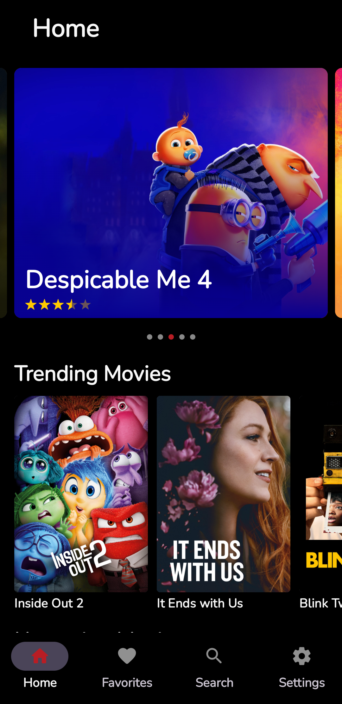 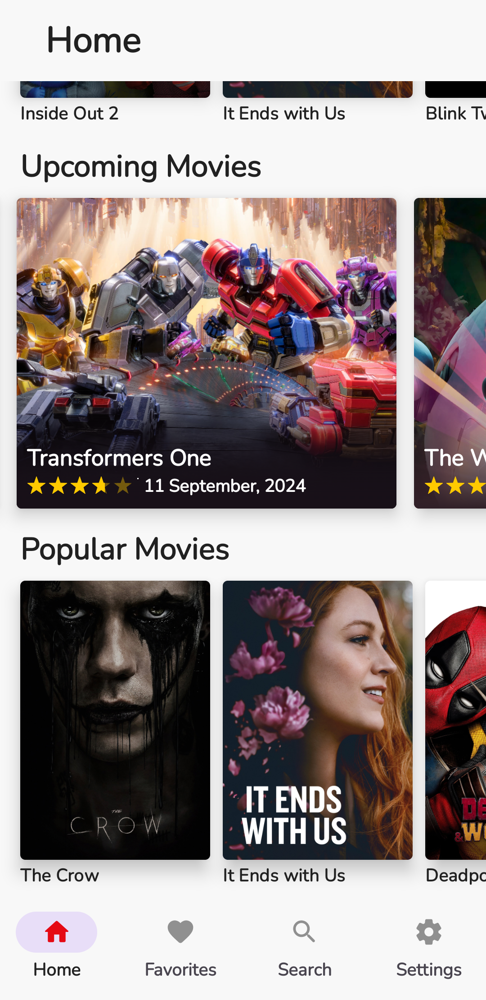 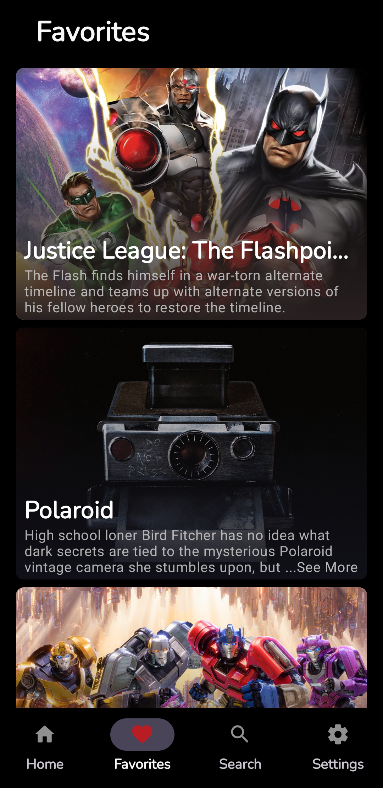 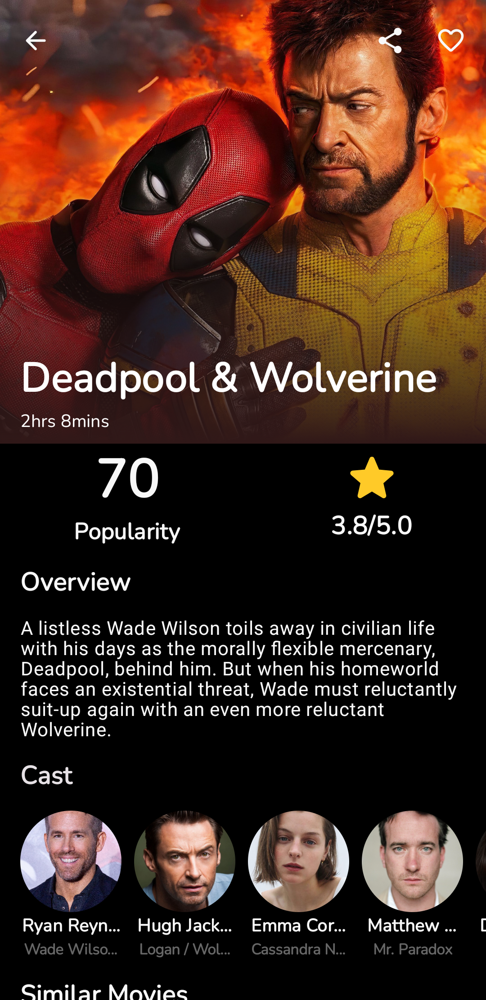 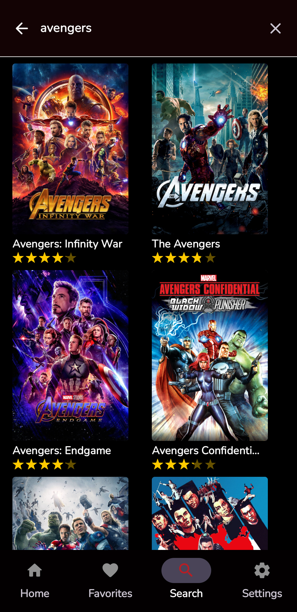 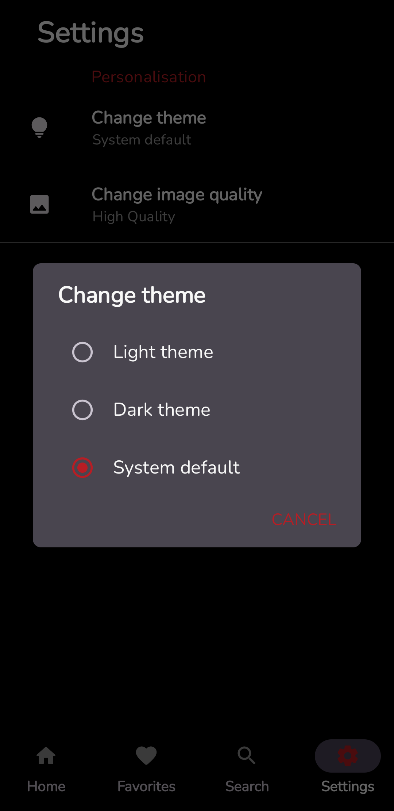

iOS
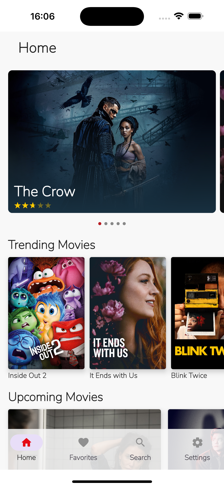 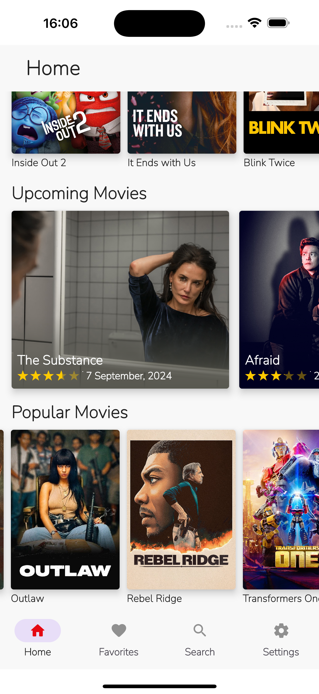  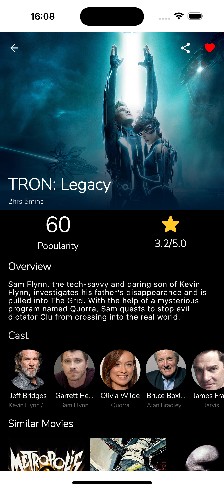 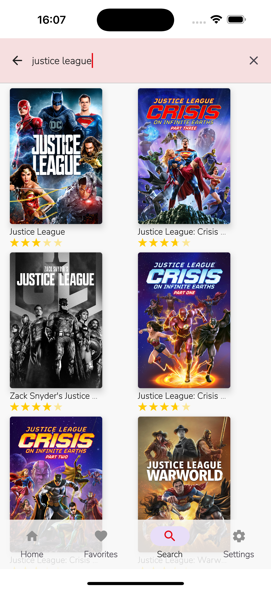 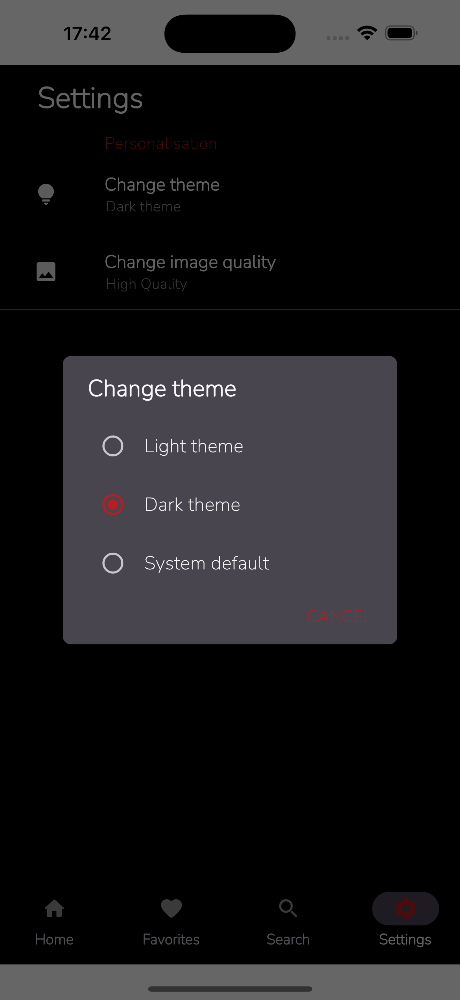

Desktop
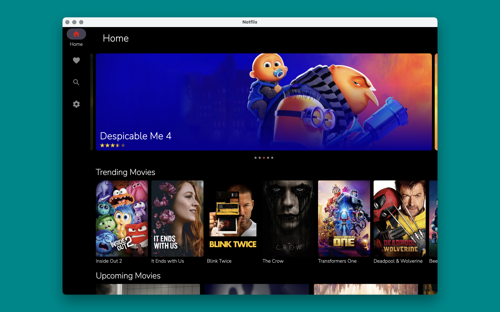 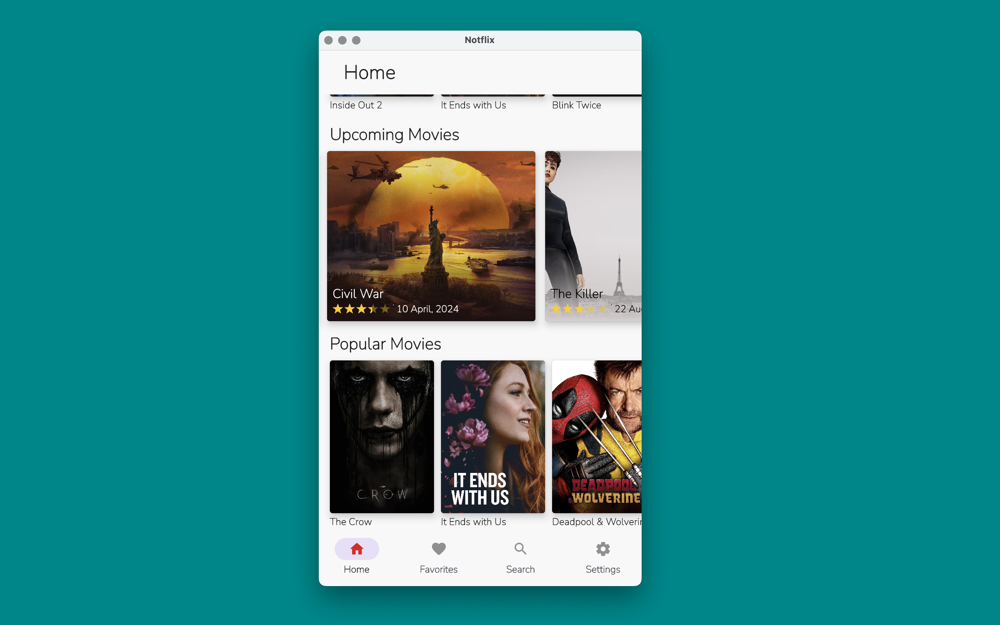

🚀 Setup
Requirements
Java JDK – for building Android apps.

Android Studio – main IDE used for mobile and desktop projects.

Xcode – required for iOS development.

Kotlin Multiplatform Plugin – install this in Android Studio via Plugins settings.

Installation Guide
Clone the project:

bash
Copy
Edit
git clone -- <Link wil be shared soon>
📱 Android App
Open the project using Android Studio.

Ensure your emulator or real device is connected.

Add your TMDB API key to local.properties:
(Mine Personal TMDB API Key is added in the local.properties file for testing purposes. You can create your own TMDB API key by signing up on the TMDB website.)

properties
Copy
Edit
api_key=<YOUR_TMDB_API_KEY>
Sync and build the app using:

bash
Copy
Edit
./gradlew installDebug
🍏 iOS App
Launch the iOS module with Xcode.

Connect a simulator or physical device.

Build and run the project from Xcode.

🖥️ Desktop App
Open in Android Studio.

Build and launch using:

bash
Copy
Edit
gradlew desktopRun
🏗️ Project Breakdown
There are two primary modules in this app:

1. composeApp
   This module contains the reusable logic and UI code.

androidMain – Android-specific implementations and configurations.

iosMain – Handles iOS-specific logic and app startup routines.

desktopMain – Contains desktop app entry point and platform-specific details.

commonMain – Shared logic used by all platforms:

domain – Core app logic and models.

data – Manages API and cache layers.

ui – Cross-platform UI components via Compose.

di – Dependency injection (Koin).

2. appiOS
   Dedicated module for iOS, bridging the shared logic to native code.

🧰 Tooling
Here are the libraries and tools used:

Kotlin Multiplatform

JetBrains Compose Multiplatform

KotlinX Coroutines

AndroidX DataStore

Koin for dependency injection

kotlinx.serialization

Ktor for HTTP requests

Napier for logging

kotlinx.datetime

Room Database (KMP)

Paging for large data handling

BuildKonfig for config management

Coil3 for image loading

Compose Navigation

KMPalette for color utilities

Ktlint for formatting

Detekt for static analysis

📚 References
🎥 Tutorials
Intro to KMM Development

Code Sharing with KMM

📖 Reading List
Hands-on with Kotlin Multiplatform

KaMPKit Architecture Guide

Integrating Koin with KMM

KMM Getting Started

Beginner Guide to KMP (Part 1-3)

Using Realm in KMM

🛠️ Example Projects
KMM Playground

Fantasy Premier League App (KMM)

KaMPKit Sample

People In Space

Poetree App